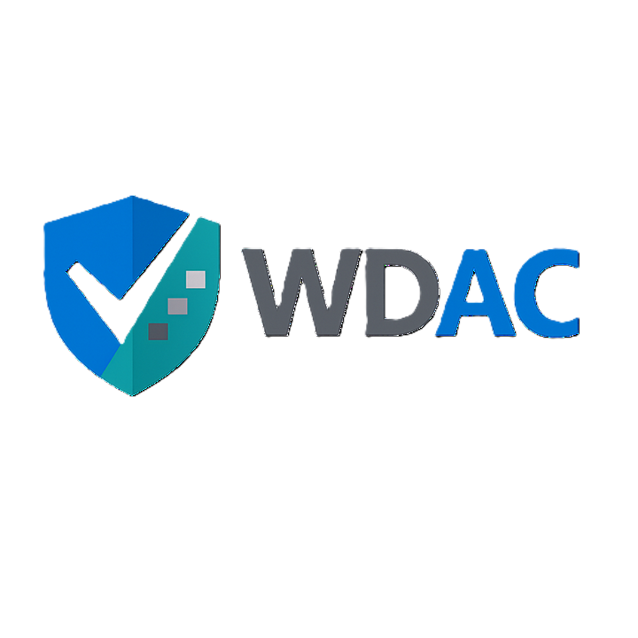

# WDAC Troubleshooting Guide

  

A step-by-step guide for managing and troubleshooting **Windows Defender Application Control (WDAC)** policies in an enterprise environment using **AppControl Manager** and **Microsoft Intune**.

## What is WDAC?

Windows Defender Application Control (WDAC) is a Windows security feature that enforces a default-deny, explicit allow-list model — only known and trusted applications are permitted to run, and everything else is blocked. It is a key component of a zero-trust endpoint strategy.

## What's in this guide?

This guide covers the day-to-day operational tasks involved in managing WDAC policies:

| Guide | Description |
|:---|:---|
| **Change Policy Settings** | Switch policies between Enforced and Audit mode |
| **Create a Supplemental Policy** | Generate allow rules for a new application |
| **Update a Supplemental Policy** | Add missing rules from Code Integrity event logs |
| **Update Policy Name & Details** | Edit Friendly Name, version, and description |
| **Validate Policies on a Device** | Verify policies applied correctly using `citool.exe` |
| **Troubleshoot Stuck Policies** | Resolve policies that fail to update via Intune |
| **Troubleshoot Deny Policy Blocks** | Identify and resolve blocks caused by deny policies |

## View the Guide

The full guide is hosted on GitHub Pages:

**[https://lozyevans.github.io/WDAC/](https://lozyevans.github.io/WDAC/)**

## Tools Used

- [AppControl Manager](https://github.com/HotCakeX/Harden-Windows-Security/wiki/AppControl-Manager) — GUI tool for creating, editing, and validating WDAC policies
- `citool.exe` — Built-in Windows tool for listing and removing WDAC policies
- **Event Viewer** (Code Integrity logs) — For identifying audit/block events
- **Microsoft Intune** — For deploying policies to managed devices

## Prerequisites

- Windows 10/11 Enterprise or Education
- Microsoft Intune for policy deployment
- AppControl Manager (available from the Microsoft Store or GitHub)
- Administrative access to target devices
