# Change Policy Settings (e.g., Enforced to Audit Mode)
{: .fs-8 }

This guide walks through changing a WDAC policy's rule options using AppControl Manager. The most common use case is switching from **Enforced Mode** to **Audit Mode** for testing, but the same process applies to any policy rule option change.
{: .fs-5 .fw-300 }

---

## Prerequisites

- Download the WDAC policies in **XML format**
- It is recommended to download all base policies (including deny policies) so you have a full set of Audit Only policies

{: .note }
> The same method can be used to change any policy settings. In this example, we will change a policy from Enforced Mode to Audit Mode.

---

## Steps

### Step 1 — Open Configure Policy Rule Options

Open **AppControl Manager** and scroll down the left menu to **Policy Management → Configure Policy Rule Options**.

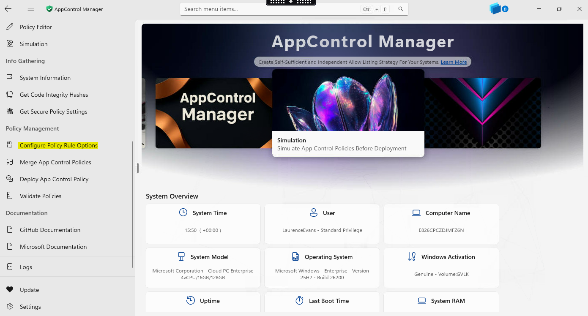

---

### Step 2 — Select the Policy File

Click **Select Policy File** and select the WDAC policy you want to edit (ensure you have downloaded the XML files prior to this step).

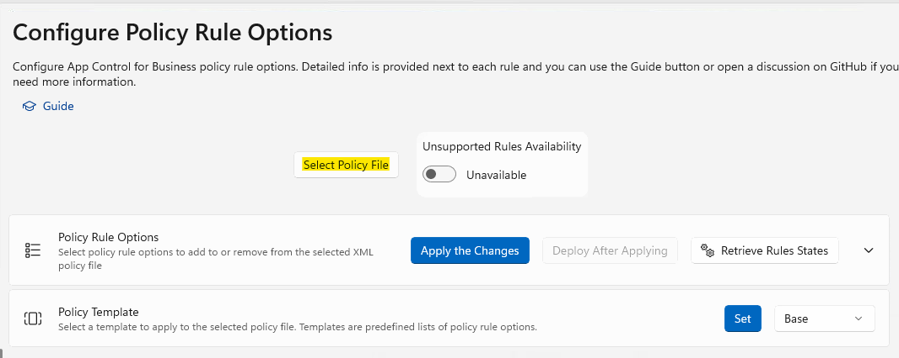

---

### Step 3 — Review Current Policy Options

This will load the policy with the currently configured options. Toggle **Unsupported Rules Availability** if you need to access options that are not shown by default.

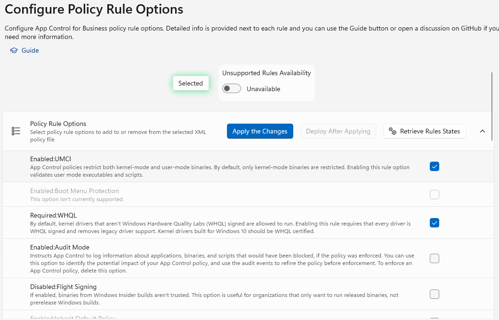

---

### Step 4 — Enable Audit Mode

Check the checkbox next to **Enabled:Audit Mode**.

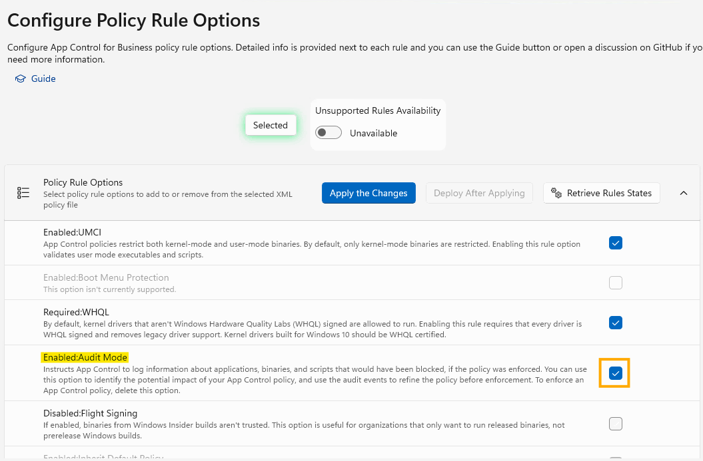

---

### Step 5 — Apply the Changes

Click **Apply the Changes** to save the updated rule options to the policy XML file.

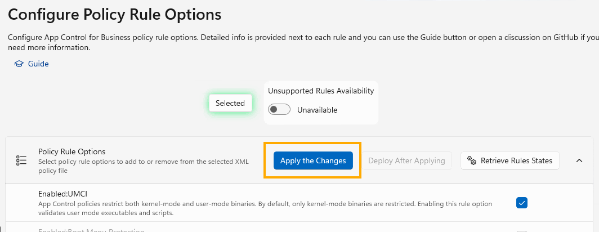

---

### Step 6 — Open the Policy Editor

From the left menu, select **Policy Editor**.

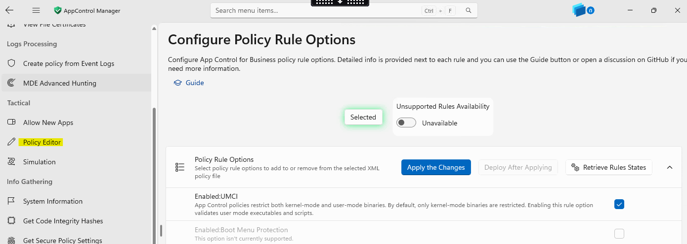

---

### Step 7 — Select the Updated Policy File

Click **Select Policy File** and select the policy you just updated.

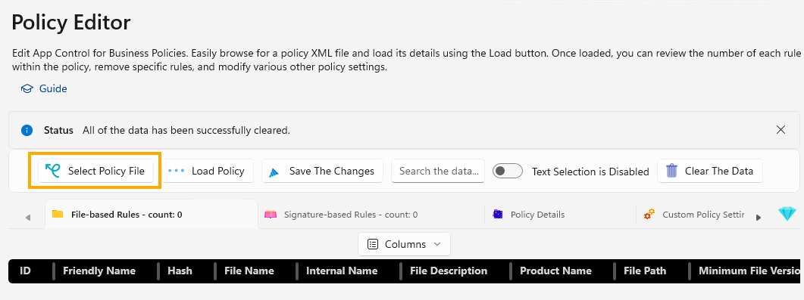

---

### Step 8 — Load the Policy

Click **Load Policy** to load the policy into the editor table.

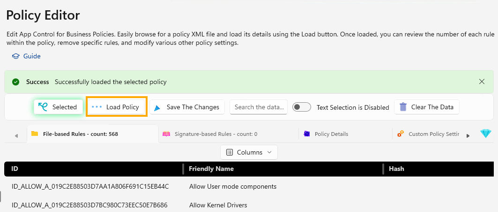

---

### Step 9 — Open Policy Details

Click on **Policy Details** to view and edit the policy metadata.

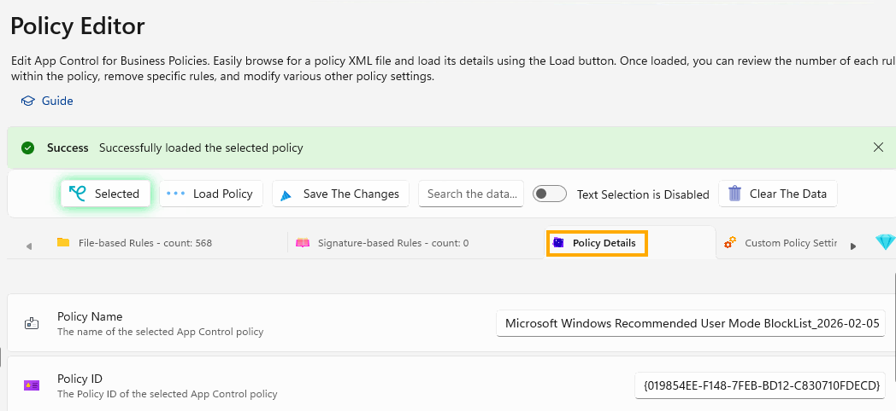

---

### Step 10 — Update the Policy Name

Update the **Policy Name** to reflect the change (e.g., add "Audit" to the name). Update the description and date at the end to reflect the date of change.

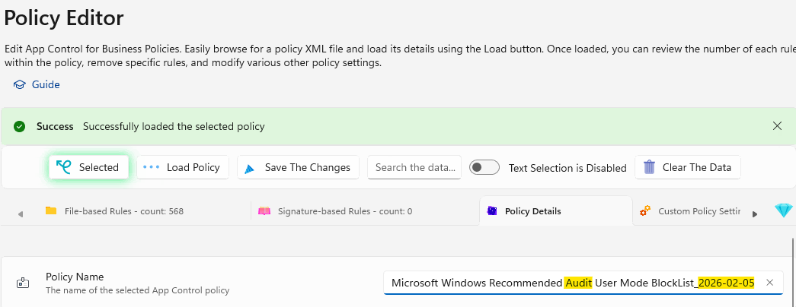

{: .warning }
> Ensure the **version number** is higher than the one already deployed, otherwise the policy will not apply via Intune and will show an error.

{: .note-title }
> Understanding WDAC Version Numbers
>
> WDAC policies use a four-part version format: **`Major.Minor.Build.Revision`** (e.g., `10.0.5.1`).
>
> When updating a policy, increment the **rightmost** segment that makes sense:
> - Minor update (e.g., adding audit mode): `10.0.5.1` → `10.0.5.2`
> - Significant change (e.g., new rules added): `10.0.5.1` → `10.0.6.0`
>
> Intune compares version numbers numerically. If the new version is **not higher** than the currently deployed version, the device will reject the update and report an error in the Intune Portal.

---

### Step 11 — Save the Changes

Click **Save The Changes**.

---

### Step 12 — Deploy via Intune

Within the Intune Portal, create the corresponding WDAC Audit Policy and upload the XML files to it. Assign to devices for testing.

---

### Step 13 — Verify on the Client

To verify the policies have updated on the client, open an **elevated PowerShell window** and run:

```powershell
citool.exe --list-policies
```

Check the **Friendly Name** of the policies and confirm they match the newly created/updated policies. You can also use the **Policy ID** to confirm.

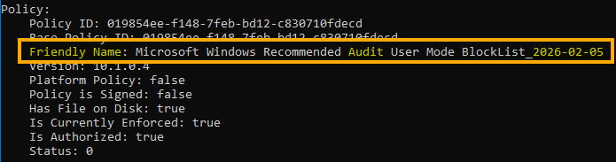
