# How to Generate a New Supplemental Policy
{: .fs-8 }

This guide walks through creating a new supplemental allow policy for an application using AppControl Manager, combining both folder scanning and event log analysis.
{: .fs-5 .fw-300 }

---

## Prerequisites

- The **base policy** downloaded in XML format
- All WDAC policies are in **Audit Mode** (see [Change Policy Settings](change-policy-settings.md))
- The application to be allowed is ready to install

---

## Part 1 — Prepare the Device

### Step 1 — Sync the Device to Intune

Log in to the device and synchronise to Intune:

**Settings → Accounts → Access Work or School**

Select the dropdown arrow next to your account and click **Info**.

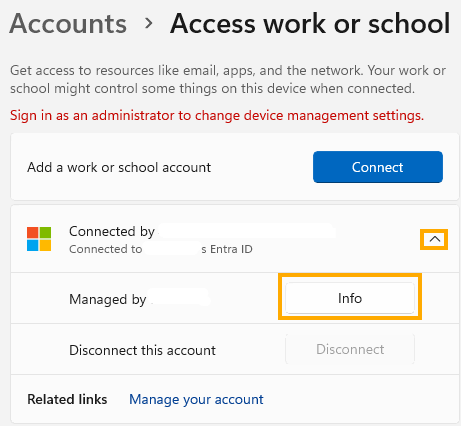

---

### Step 2 — Trigger a Sync

Scroll to the bottom of the page and click **Sync**.

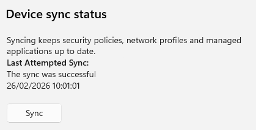

---

### Step 3 — Verify Audit Mode with CITool

Open an **elevated PowerShell session** and run:

```powershell
citool.exe --list-policies
```

Verify that all base policies are in **Audit Mode**. There should be at least three policies: the Base Allow, Deny Driver, and Deny User Mode Blocklist policies.

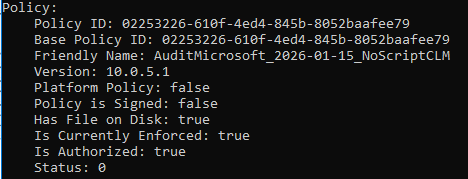

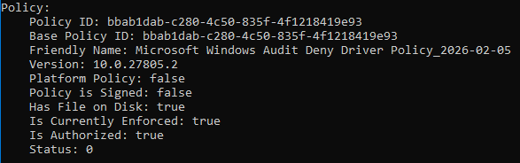

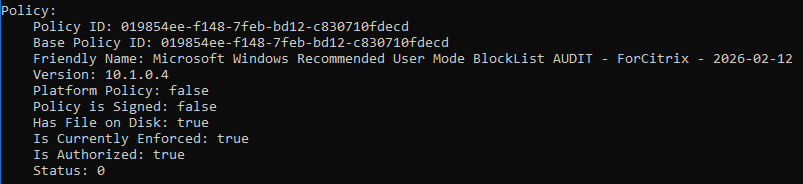

---

### Step 4 — Clear Code Integrity Logs

Open **Event Viewer** and clear the Code Integrity logs:

**Application and Services Logs → Microsoft → Windows → Code Integrity → Operational**

Right-click the **Operational** log and select **Clear Log**.

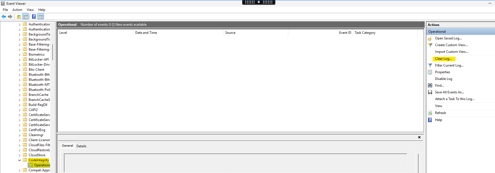

{: .important }
> Clearing the logs before installing the application ensures you only capture events related to that specific application.

---

## Part 2 — Install the Application and Capture Events

### Step 5 — Install the Application

Install the application for which you want to create a supplemental policy. In this example, we are using **Google Chrome**.

Open **Company Portal** if the app is published and click **Install**, or install the app from the desktop if you have admin rights.

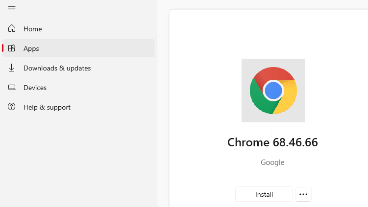

---

### Step 6 — Check for Updates

Once the app is installed, check for updates to capture the update process in the event logs as well.

---

### Step 7 — Check Event Logs for Audit Events

Go back to **Event Viewer**, filter on **Event ID 3076**, then search for the application name (in this case, "Chrome").

This shows whether there are any events that need to be captured in the supplemental policy.

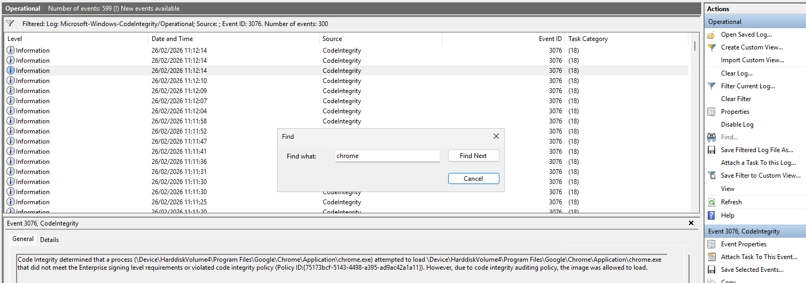

---

### Step 8 — Export the Event Logs

Export the Code Integrity event logs and save them locally for use in the next steps.

---

## Part 3 — Create the Supplemental Policy (Folder Scan)

### Step 9 — Open Create Supplemental Policy

Open **AppControl Manager** and select **Create Supplemental Policy** from the left menu.

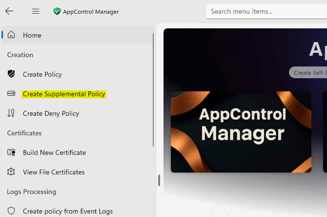

---

### Step 10 — Configure the Policy

Fill in the following fields:

| Field | Value |
|:---|:---|
| **Mode** | Create New Policy |
| **Browse For Folders** | Select the installation folder (e.g., `C:\Program Files\Google\Chrome`). Multiple folders can be selected. |
| **Policy Name** | Use a descriptive naming convention, e.g., `EUD-CPC-EPS-Windows-WDAC-Supplemental-Allow-Chrome-2026-02-26` |
| **Base Policy File** | Select the Base Allow policy XML |

{: .note-title }
> Choosing a Scan Level
>
> AppControl Manager uses a **scan level** (also called "rule level") to determine how files are identified in the policy. The level you choose affects both the **specificity** of the rule and the **maintenance burden** when applications update.
>
> | Scan Level | What It Matches | Pros | Cons |
> |:---|:---|:---|:---|
> | **Hash** | Exact file hash | Most specific — only allows that exact binary | Breaks on every update; every new version needs a new rule |
> | **FileName** | Internal file name attribute | Survives updates if the filename stays the same | Could match unintended files with the same internal name |
> | **FilePublisher** | Publisher + file name + minimum version | Good balance — allows updates from the same publisher for the same file | Requires files to be signed |
> | **Publisher** | Certificate publisher only | Very broad — allows anything signed by that publisher | Over-permissive; trusts all software from that publisher |
> | **WHQLFilePublisher** | WHQL-certified publisher + file + version | Best for drivers | Only applicable to WHQL-signed drivers |
>
> **Recommendations:**
> - For most LOB applications, use **FilePublisher** — this allows seamless updates while remaining specific
> - Use **Hash** only when the file is unsigned or you need maximum specificity
> - Avoid **Publisher** unless you fully trust all software from that publisher (e.g., Microsoft)
> - For drivers, use **WHQLFilePublisher** when available

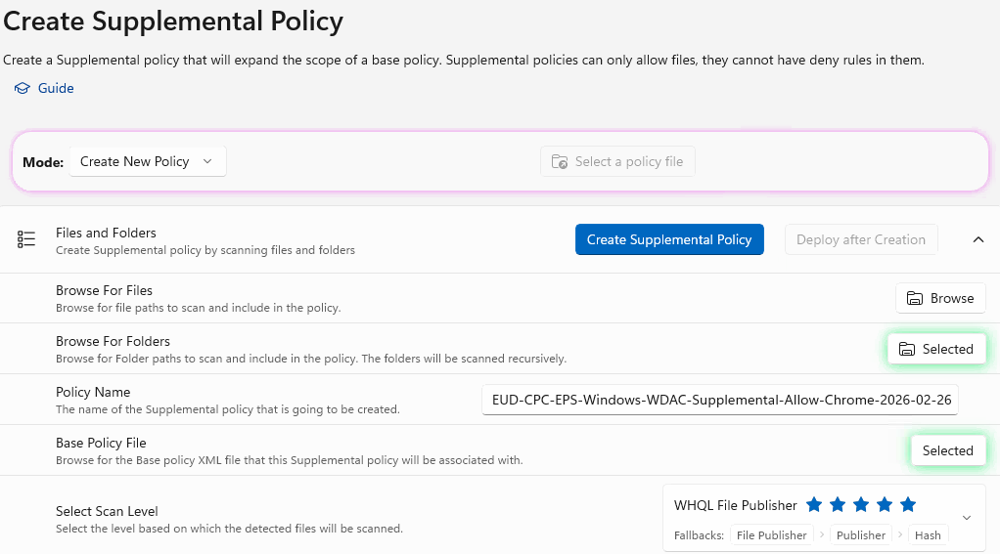

---

### Step 11 — Create the Policy

Click **Create Supplemental Policy**.

---

### Step 12 — Confirm Success

The **Success** banner will appear when the policy has been created.

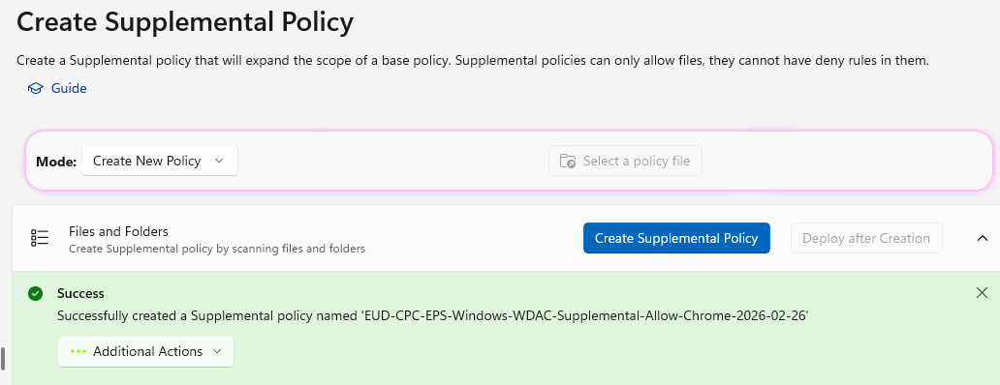

---

### Step 13 — Review Detected Files

Click **View detected file details** to review what has been captured in the policy.

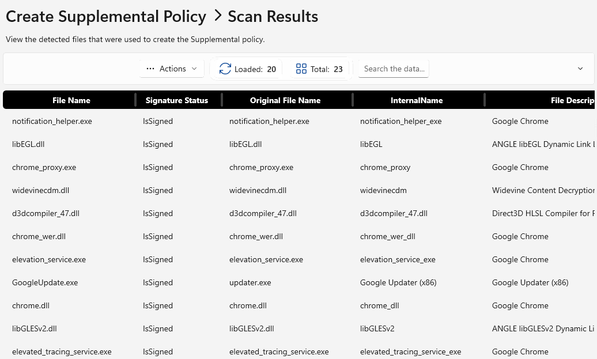

---

### Step 14 — View the Policy (Optional)

Under **Additional Actions**, select the dropdown and choose **Open In The Policy Editor** to review the policy contents.

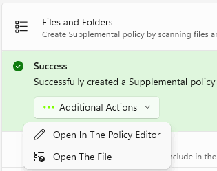

---

### Step 15 — Save the Policy File

If you did not save the file to a specific location, the XML file will be saved to:

```
C:\Users\[User]\AppData\Local\Packages\VioletHansen.AppControlManager…\LocalCache\PoliciesLibraryCache
```

Copy the policy to a known folder (such as Documents) and rename it if needed.

---

## Part 4 — Enrich the Policy from Event Logs

### Step 16 — Open Create Policy from Event Logs

Go back to AppControl Manager. From the left menu, select **Create Policy from Event Logs**.

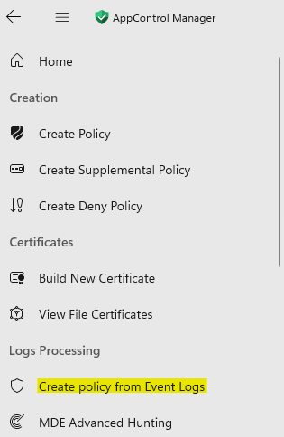

---

### Step 17 — Select the Event Log File

Click **Select Code Integrity EVTX Files** and select the event log file you exported in Step 8.

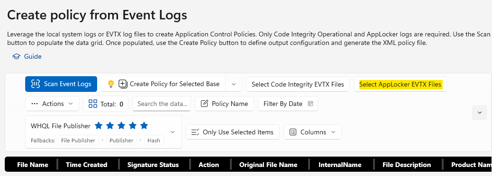

---

### Step 18 — Select the Target Policy

Click the **dropdown** next to **Create Policy for Selected Base**.

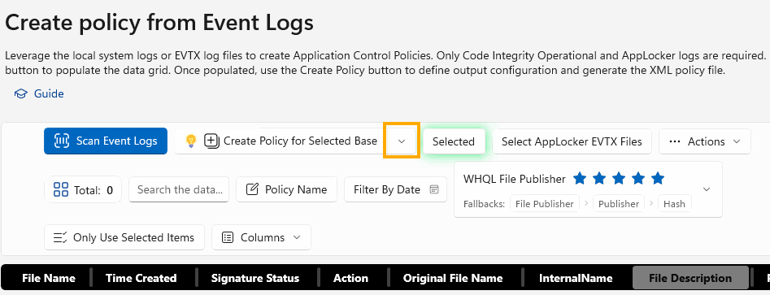

---

### Step 19 — Browse for the Supplemental Policy

Click **Browse** and select the newly created supplemental policy from Part 3.

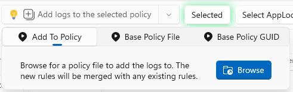

---

### Step 20 — Associate the Base Policy

Either click on the **Base Policy File** button and attach the Base Policy, or enter the **Base Policy GUID** to associate the supplemental policy with its base.

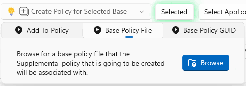

{: .important-title }
> Multiple Base Policies
>
> Each supplemental policy is linked to exactly **one** base policy via the **Base Policy ID** (a GUID). If your environment uses multiple base policies (e.g., separate base policies for different device types or security tiers), ensure you are associating the supplemental policy with the **correct** base.
>
> A supplemental policy will **only be evaluated** by the WDAC engine if the base policy it references is also present on the device. If the base policy is missing, the supplemental policy is ignored.
>
> You can check which base a supplemental policy is linked to by looking at the `<BasePolicyID>` element in the supplemental policy XML, or by comparing the **Base Policy ID** field in `citool.exe --list-policies` output.

---

### Step 21 — Scan Event Logs

Click **Scan Event Logs** to identify files from the event log that need to be included.

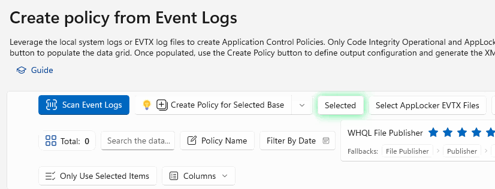

---

### Step 22 — Select Relevant Files

Any identified files will be listed. Review each entry and **only select the files related to the application** you are working on (in this case, Chrome).

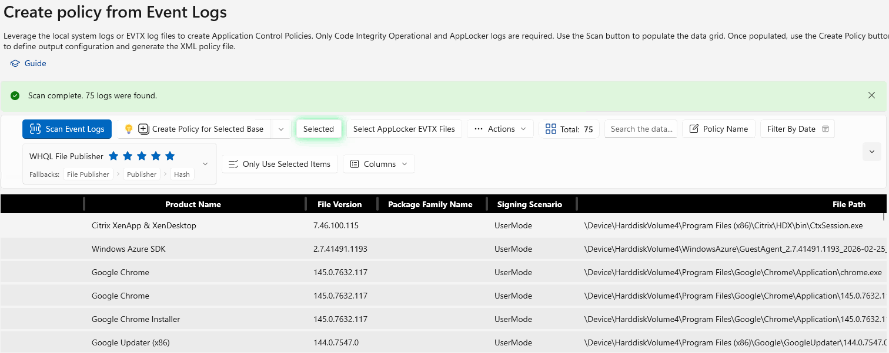

{: .warning }
> Be selective — only include files that are specifically related to the application. Including unrelated files could weaken the security of your WDAC policy.

---

### Step 23 — Add Logs to the Policy

Click **Add logs to the selected policy**.

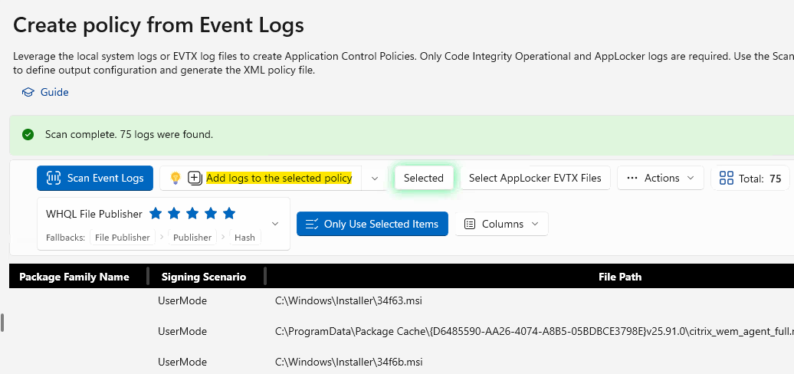

---

### Step 24 — Confirm Success

Confirm the logs have been added successfully.

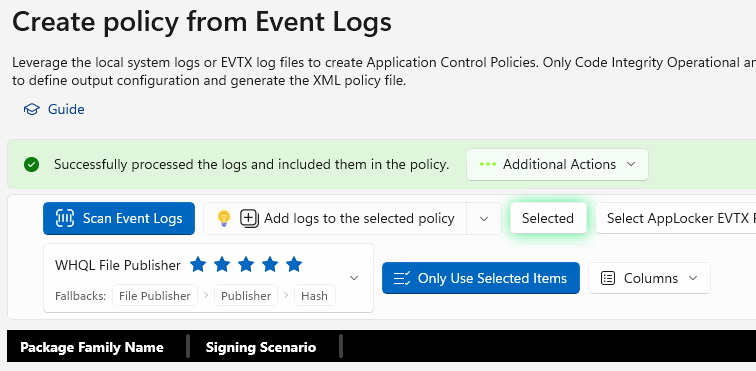

---

## Part 5 — Deploy and Validate

### Step 25 — Upload to Intune

From the **Intune Portal**, create a new AppControl Policy and attach the new XML file.

### Step 26 — Sync the Device

Sync the device and run CITool to verify the policy has been applied:

```powershell
citool.exe --list-policies
```

### Step 27 — Check for Remaining Blocks

Check the Code Integrity event logs (Event ID 3076) for any further audit blocks. If there are additional blocks, repeat the event log enrichment process (Part 4).
