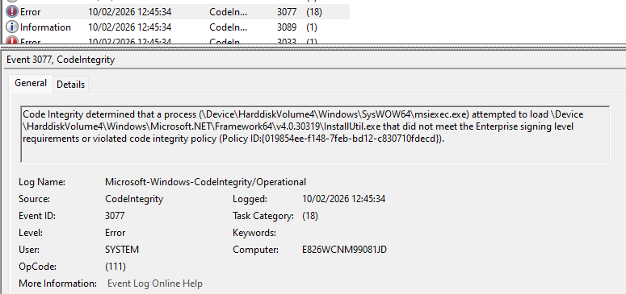
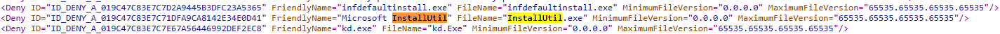
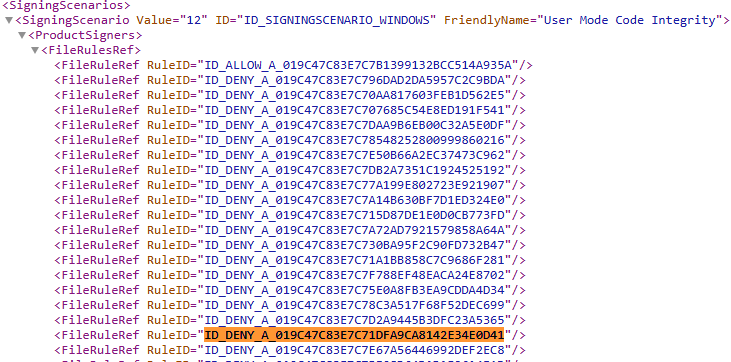
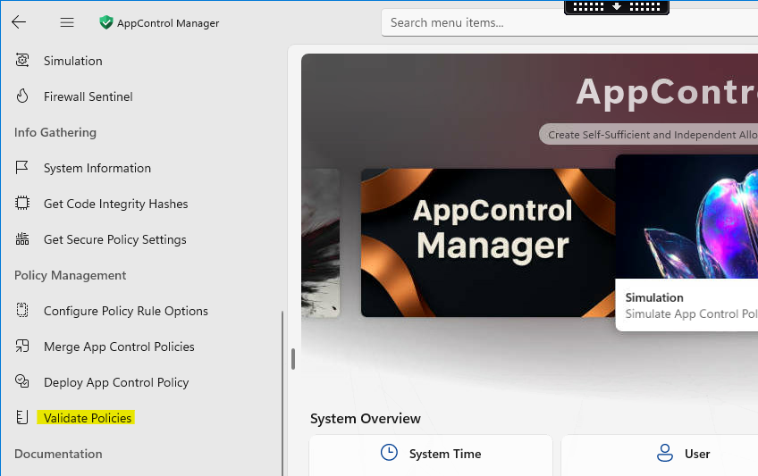
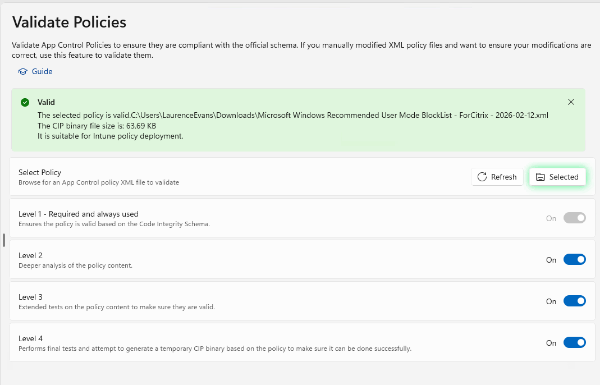

# How to Read Event Logs and Troubleshoot Deny Policies
{: .fs-8 }

If you have created the Base Allow Policy, Deny Driver and Deny User Mode Block List policies, associated supplemental policies, and an application is still not working correctly — the Code Integrity event logs can help identify which specific policy is causing the block.
{: .fs-5 .fw-300 }

---

## Prerequisites

- The device has **Audit Mode** policies applied (including Deny User and Deny Driver Block policies)
- Enforced policies are **not** currently applied

{: .important }
> You must use Audit Mode policies for initial investigation. In audit mode, blocks are logged as **Event ID 3076** (Information). In enforced mode, blocks are logged as **Event ID 3077** (Error).

---

## Part 1 — Capture and Identify the Blocking Policy

### Step 1 — Confirm Audit Policies Are Applied

Run CITool to verify that Audit Mode policies are in place and no enforced policies are listed:

```powershell
citool.exe --list-policies
```



---

### Step 2 — Clear Code Integrity Event Logs

Open **Event Viewer** and clear the logs:

**Application and Services Logs → Microsoft → Windows → Code Integrity → Operational**

---

### Step 3 — Reproduce the Issue

Run or install the application that is being blocked by WDAC enforcement.

---

### Step 4 — Export the Event Logs

Export the Code Integrity logs so they do not become bloated by continued logging.

---

### Step 5 — Search for Event ID 3076

Open the exported event logs and search for events with **Event ID 3076**.

In **Audit Mode**, these appear as **Information** events:



In **Enforced Mode**, the equivalent event is **Event ID 3077** and appears as an **Error**:


{: .note-title }
> Tip: Use Event ID 3089 for Signing Details
>
> When you find a 3076 or 3077 event, look for a corresponding **Event ID 3089** entry logged immediately after it. This event contains **signing information** for the blocked file — including the signer name, publisher, and file hash. This is invaluable for deciding whether to create a rule by **Publisher**, **FilePublisher**, or **Hash**.
>
> Key fields in Event ID 3089:
> - **PublisherName** — The certificate publisher (e.g., `O=GOOGLE LLC, L=MOUNTAIN VIEW, S=CALIFORNIA, C=US`)
> - **IssuerName** — The issuing certificate authority
> - **SHA256 Hash** — The file's hash value (useful for hash-based rules)
> - **SHA256 FlatHash** — Authenticode hash used in WDAC policies

---

### Step 6 — Identify the Blocking Policy ID

The key piece of information in the event log entry is the **Policy ID**. This tells you which specific policy is causing the block.

In this example, the Policy ID ends in **`0fdecd`**.

---

### Step 7 — Match the Policy ID Using CITool

Run CITool and search through the list to find the policy matching this ID:

```powershell
citool.exe --list-policies
```



---

### Step 8 — Understand the Implications

Now that you know which policy is blocking, determine the appropriate remediation:

- If the **Supplemental Allow Policy** is blocking → add the missing rules to the supplemental policy (see [Update Supplemental from Event Logs](update-supplemental-from-logs.md))
- If the **Deny User Mode Block List** or **Deny Driver Policy** is blocking → the deny list **overrides** any allow rules, so you must modify the deny policy itself

{: .warning }
> If the blocking policy is a **deny policy**, adding rules to the allow or supplemental policy will **not** resolve the issue. Deny always wins over allow.

---

## Part 2 — Modify the Deny Policy (If Required)

{: .warning }
> Modifying deny policies relaxes security controls. This should require formal approval through your organisation's change management process.

### Step 9 — Open the Deny Policy in VS Code

Open the deny policy XML file in **VS Code**. The User Mode Block List policy contains many items including DLLs, EXEs, and PowerShell entries that are blocked when enforced.

---

### Step 10 — Find the Blocked Item

Search the XML for the item identified as being blocked in the event log. In this example, we search for **`InstallUtil.exe`**.



{: .warning-title }
> Security Warning: LOLBIN Awareness
>
> Many executables on the Microsoft Recommended Block Lists are **LOLBINs** (Living Off the Land Binaries) — legitimate system tools that are commonly abused by attackers. Examples include:
>
> | Binary | Legitimate Use | Attack Use |
> |:---|:---|:---|
> | `InstallUtil.exe` | .NET installer utility | Bypass application whitelisting, execute arbitrary code |
> | `MSBuild.exe` | Build automation | Execute malicious project files without dropping EXEs |
> | `Regsvr32.exe` | COM registration | Download and execute remote scripts (squiblydoo) |
> | `MSHTA.exe` | HTML applications | Execute VBScript/JScript from remote URLs |
> | `CertUtil.exe` | Certificate management | Download files, decode payloads |
>
> **Before removing any item from a deny policy:**
> 1. Confirm whether the application genuinely requires it (check the event logs)
> 2. Consider scoping the exception as narrowly as possible — by **hash** or **file path** rather than removing the entire deny rule
> 3. Document the business justification and get formal approval
> 4. Monitor for abuse after the change is deployed
>
> Reference: [Microsoft Recommended Block Rules](https://learn.microsoft.com/en-us/windows/security/application-security/application-control/app-control-for-business/design/applications-that-can-bypass-appcontrol)

---

### Step 11 — Remove the Deny Rule

You need to remove **two** elements from the XML:

**1. The `<Deny>` rule** — Find the deny rule entry for the blocked item and note its **ID** (highlighted below). Delete the entire `<Deny ... />` line.

**2. The `<FileRuleRef>`** — Search the XML for the ID you copied. There will be a `<FileRuleRef>` within a `<SigningScenario>` element that references this rule. Delete this line as well.



{: .warning }
> Be very careful not to break the XML structure. Always validate the policy after making changes.

---

### Step 12 — Check for Additional Blocks

Search the Code Integrity event logs for any other items blocked by the **same policy** and repeat the removal process for each.

---

### Step 13 — Validate the Modified Policy

Open **AppControl Manager** and navigate to **Policy Management → Validate Policies**.

1. Click **Browse** and select the modified policy file
2. The validation will run automatically and show the result


{: .note }
> If validation fails, review your XML edits for structural errors (mismatched tags, missing elements, etc.).

---

## Part 3 — Deploy and Test

### Step 14 — Test in Audit Mode First

If the policy is valid:
1. [Update the Friendly Name](update-policy-name.md) to reflect the change
2. Upload the modified policy to Intune as an **Audit Mode** policy
3. Deploy to test devices and verify the application works without generating 3076 events

### Step 15 — Switch to Enforced Mode

Once testing is successful:
1. [Change the policy back to Enforced Mode](change-policy-settings.md)
2. Update the Friendly Name
3. Upload to Intune and deploy

### Step 16 — Final Validation

Apply the enforced mode policies and re-test the application to confirm everything works correctly.

---

## Event ID Quick Reference

| Event ID | Mode | Severity | Meaning |
|:---|:---|:---|:---|
| **3076** | Audit | Information | A binary *would have been* blocked if the policy were enforced |
| **3077** | Enforced | Error | A binary *was blocked* by an enforced policy |
| **3089** | Both | Information | Signing information for a file that was audited/blocked |

---

## Key Takeaway

{: .important }
> If after collecting event logs and updating supplemental policies you still see items being blocked, check whether the blocked executable is listed in the **User Deny Policy**. The executable may be allowed by the supplemental policy, but if it is listed in the deny policy, **deny always wins**. To overcome this, you must relax the deny policy — this should require approval through your change management process.
