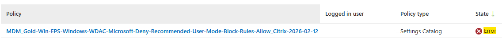
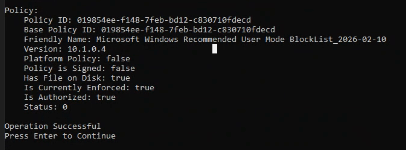
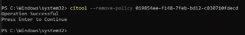
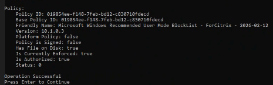
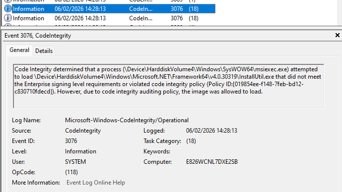

# Troubleshoot Stuck / Stale Policies
{: .fs-8 }

If a new WDAC policy is not applying and the Intune Portal shows an error, it is likely that the old policy is not being removed and is blocking the application of the new one.
{: .fs-5 .fw-300 }

---

## Symptoms

- Intune shows an **error status** for the WDAC policy assignment
- Running `citool.exe --list-policies` shows the **old** Friendly Name or version
- After sync and reboot, the policy still does not update



---

## Resolution Steps

### Step 1 — Identify the Stuck Policy

Log in to the affected machine and open an **elevated PowerShell session**. Run:

```powershell
citool.exe --list-policies
```

Find the **Policy ID** for the policy that is not updating and copy it.





---

### Step 2 — Remove the Stuck Policy

Run the following command, replacing `<Policy ID>` with the GUID you copied:

```powershell
citool.exe --remove-policy "<Policy ID>"
```

For example:

```powershell
citool.exe --remove-policy "{019854EE-F148-7FEB-BD12-C830710FDECD}"
```



Confirm the removal was successful by listing the policies again:

```powershell
citool.exe --list-policies
```

{: .warning }
> Removing a policy temporarily leaves the device without that specific policy protection until the new policy is applied. Perform this during a maintenance window if possible.

---

### Step 3 — Sync the Device

Sync the device with Intune using either:
- **Company Portal** → Sync button
- **Settings → Accounts → Access Work or School** → Info → Sync

Then **reboot** the device.

---

### Step 4 — Verify the New Policy

After reboot, open an elevated PowerShell prompt and run:

```powershell
citool.exe --list-policies
```

Confirm the new policy has been applied with the correct Friendly Name and version.


---

### Step 5 — Check Intune Status

From the **Intune Portal**, the policy status should update and show **Succeeded**.



---

## Recovery — If a Base Policy Is Accidentally Removed

If a critical base policy is accidentally removed using `citool.exe --remove-policy`, the device may be left without WDAC enforcement until the policy is reapplied.

**To recover:**

1. **Sync the device with Intune** — The assigned WDAC policies will be re-delivered on the next sync cycle.
2. **Reboot the device** — WDAC policies take effect after a reboot.
3. **Verify with CITool** — Run `citool.exe --list-policies` to confirm the base policy has been reapplied.

```powershell
# Force an Intune sync and verify
Start-Process "companyportal:"  # Open Company Portal to trigger sync
# After sync and reboot:
citool.exe --list-policies
```

{: .important }
> Always ensure the base policy is still assigned in Intune before removing a local policy. As long as the Intune assignment is active, the policy will be redelivered on the next sync. If you are unsure, check the Intune Portal before running `--remove-policy`.
