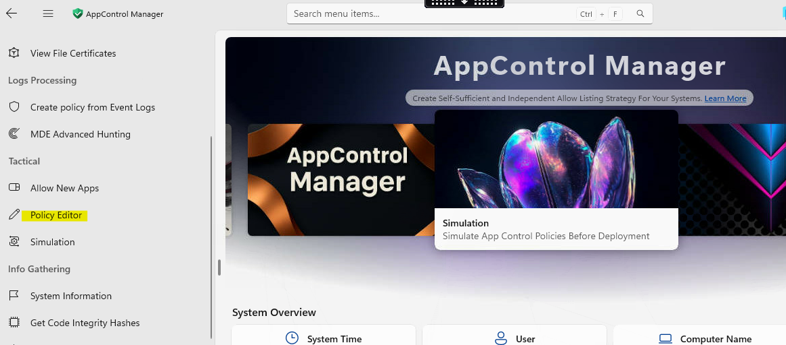
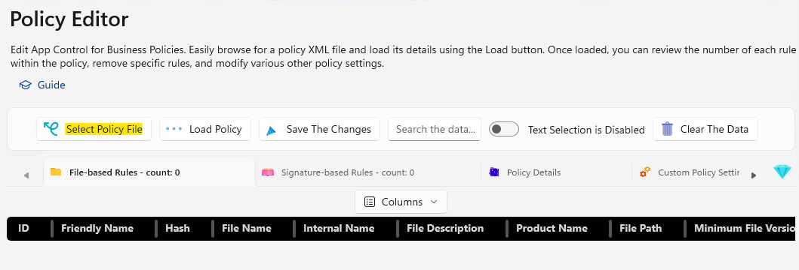
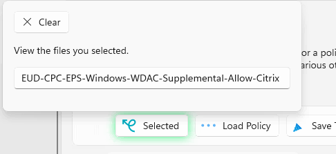
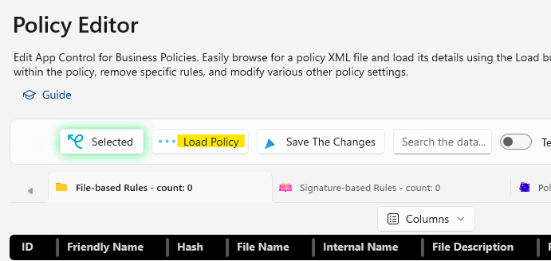
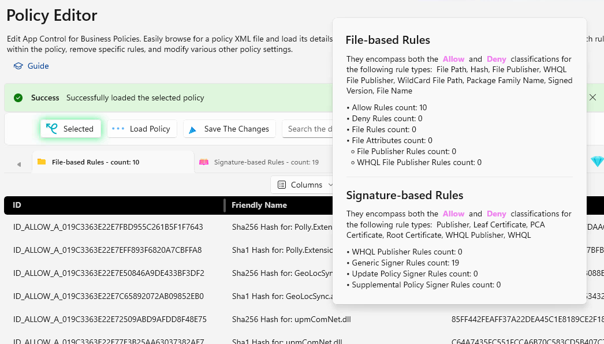
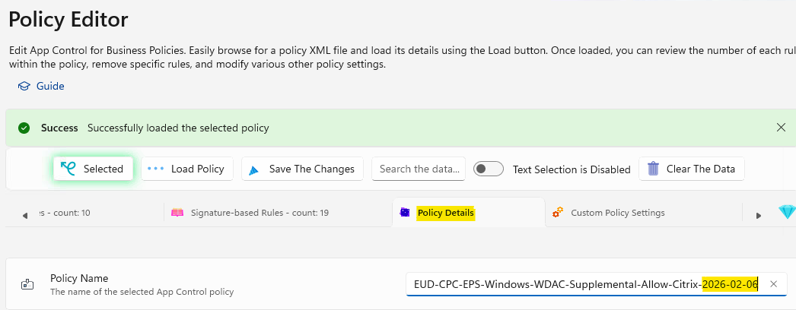
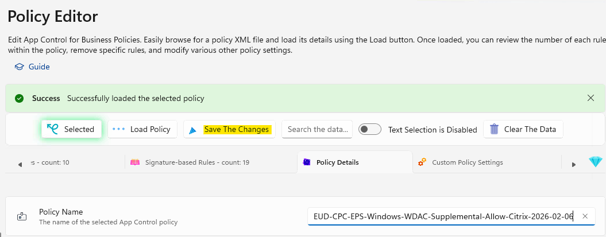

# Update the Policy Friendly Name and Save Changes
{: .fs-8 }

After creating or updating a WDAC policy, you should update the Friendly Name to reflect the change and date. The Friendly Name is what appears when you run `citool.exe --list-policies` on a device, making it essential for identifying policies at a glance.
{: .fs-5 .fw-300 }

---

## Steps

### Step 1 — Open AppControl Manager

Open **AppControl Manager** (requires elevation).

---

### Step 2 — Open the Policy Editor

From the left menu, select **Policy Editor**.

---

### Step 3 — Select the Policy File

Click **Select Policy File** — this will open a file dialog. Select the supplemental policy you want to update.

---

### Step 4 — Confirm File Selection

A message will appear confirming you have selected the file.

{: .note }
> Click somewhere outside of the dialog box and **do not select Clear**, as this will clear the selection.

---

### Step 5 — Load the Policy

Click **Load Policy**.

---

### Step 6 — Review the Loaded Policy

The policy will load into the policy editor, showing file-based rules, signature-based rules, and other details.

---

### Step 7 — Update the Policy Name

Click **Policy Details** and update the **Policy Name** to include the date the policy was updated.

The Friendly Name is what will appear when running `citool.exe --list-policies` on the device.

---

### Step 8 — Save the Changes

Click **Save The Changes**.

---

### Step 9 — Upload to Intune

Upload the updated policy to **Intune** and to **SharePoint** (or your policy repository) for any future required changes.
