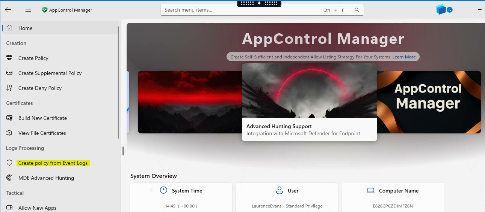
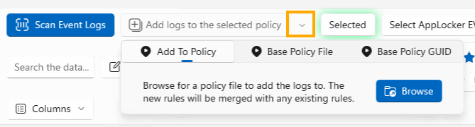
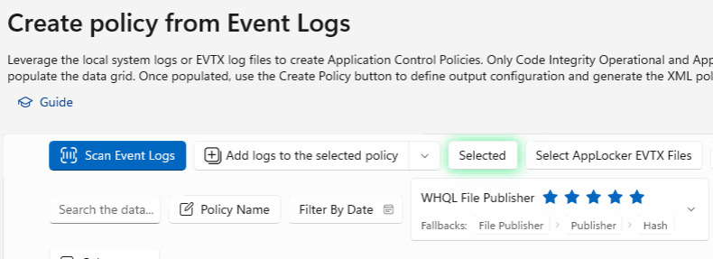
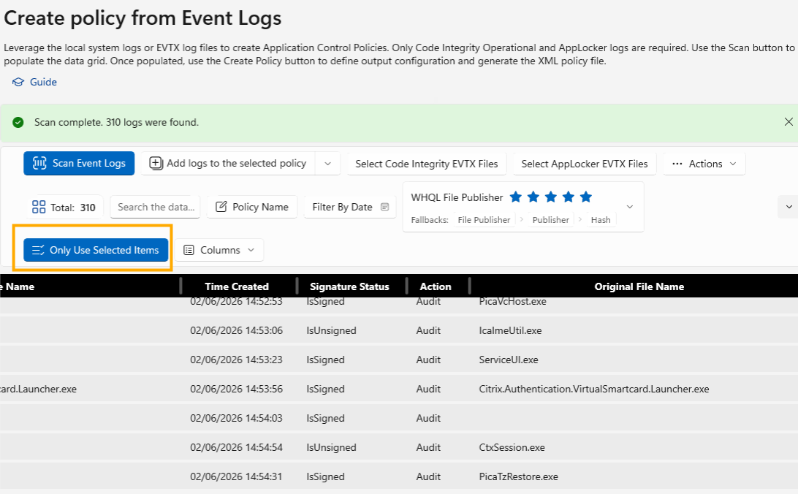
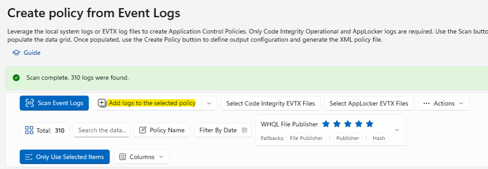
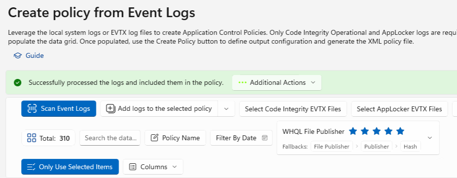
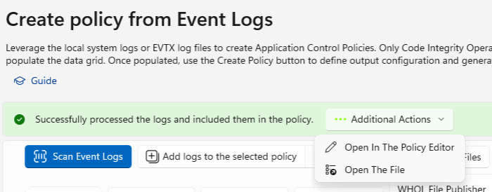

# Use Event Logs to Update a Supplemental Policy
{: .fs-8 }

When an application is being partially blocked by WDAC, you can use exported Code Integrity event logs to identify the missing rules and add them to an existing supplemental policy.
{: .fs-5 .fw-300 }

---

## Prerequisites

- Exported Code Integrity Operational logs from Event Viewer on a machine that is in **Audit Mode**
  - Path: `Application and Services Logs → Microsoft → Windows → Code Integrity → Operational`
- The **supplemental policy** to be updated (original XML file)
- The **Base policy ID** or the Base policy XML which the supplemental policy is associated with
- A **backup copy** of the supplemental policy XML before any merge operation (see warning below)

{: .best-practice }
> **Best Practice:** Clear the event logs before installing the app, install the app, then export the event logs. This ensures you only capture events related to that specific application.

{: .warning-title }
> Back Up the Original Policy Before Merging
>
> The **Add logs to the selected policy** action in AppControl Manager does not always perform a true merge — in some cases it has been observed to overwrite the target policy with only the newly added rules, effectively replacing existing rules rather than appending to them.
>
> Before running any merge, **always make a backup copy of the original supplemental policy XML** (e.g., `MyPolicy.xml.bak`). If the merge result is missing previously authored rules, restore from the backup and try one of the following:
>
> - Re-run the merge in AppControl Manager and re-validate the rule count in the resulting XML
> - Use the **Microsoft WDAC Wizard** (Application Control Wizard) — its merge function has been reliable in practice and is a safe fallback when the community tool produces unexpected results
>
> After any merge, open the resulting XML and confirm both the original rules and the new rules are present before deploying.

---

## Example Scenario

In this example, we will use exported event logs from a failed **Citrix** component and use AppControl Manager to update the supplemental policy with the items found from the event logs.

---

## Steps

### Step 1 — Open AppControl Manager

Open **AppControl Manager** (requires elevation).

---

### Step 2 — Open Create Policy from Event Logs

From the left menu, select **Create Policy from Event Logs**.

---

### Step 3 — Select the Event Log File

Click **Select Code Integrity EVTX Files** and select the exported event viewer log file.

---

### Step 4 — Open the Add Logs Dropdown

Click the dropdown arrow on **Add logs to the selected policy**.

---

### Step 5 — Select the Policy to Update

Click **Browse** and select the supplemental policy you want to update.

---

### Step 6 — Associate the Base Policy

Click the dropdown arrow again and select either **Base Policy File** or **Base Policy GUID**, depending on what you have available.

---

### Step 7 — Scan Event Logs

Click **Scan Event Logs** to identify files from the event logs.

---

### Step 8 — Select Entries to Import

Review each entry and select only the ones relevant to the application. Then click **Only Use Selected Items**.

{: .warning }
> Carefully review each entry. Only import files that are directly related to the application being allowed. Importing unrelated binaries could introduce security risks.

---

### Step 9 — Add Logs to the Policy

Click **Add logs to the selected policy**.

{: .warning }
> Confirm you have a backup of the original supplemental policy XML before clicking this button. The merge has been observed to overwrite existing rules rather than appending to them. After the merge completes, open the updated XML and verify that both the pre-existing rules and the newly added rules are present. If anything is missing, restore from the backup and merge using the **Microsoft WDAC Wizard** instead.

---

### Step 10 — Confirm Success

When the policy has been updated, the green banner will appear stating **"Successfully processed the logs and included them in the policy"**.

---

### Step 11 — Open in Policy Editor

Click **Additional Actions** and select **Open In the Policy Editor** to review the updated policy.

---

### Next Steps

Proceed to [Update Policy Name & Details](update-policy-name.md) to update the Friendly Name before uploading to Intune.
