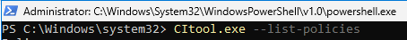
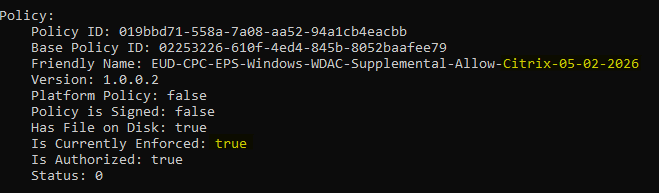

# Validate That Policies Have Updated on the Device
{: .fs-8 }

Before any testing, confirm that updated policies have been applied to the device using `citool.exe`.
{: .fs-5 .fw-300 }

---

## Steps

### Step 1 — Open an Elevated PowerShell Window

Right-click the Start menu and select **Windows Terminal (Admin)** or **PowerShell (Admin)**.

---

### Step 2 — List All Policies

Run the following command:

```powershell
citool.exe --list-policies
```

This will list all policies and whether they are enforced or not. This is where the **Friendly Name** is important for quick identification.



---

### Step 3 — Find and Verify the Updated Policy

Scroll through the list to find the newly updated policy. Confirm:

- The **Friendly Name** matches what you expect
- The policy is **enforced** (or in **audit** mode, depending on what was deployed)
- The **version number** is correct



{: .note }
> You may need to **sync the device** and **reboot** before seeing the updated policy. If after a sync and reboot you still see the old policy, see [Troubleshoot Stuck Policies](troubleshoot-stuck-policies.md).

---

## Quick Reference — CITool Output Fields

| Field | Description |
|:---|:---|
| **Policy ID** | Unique GUID identifying the policy |
| **Base Policy ID** | GUID of the base policy (matches Policy ID for base policies; differs for supplemental policies) |
| **Friendly Name** | Human-readable name set in the Policy Editor |
| **Version** | Policy version number — must increase with each update |
| **Is Currently Enforced** | `true` if the policy is actively enforcing rules |
| **Has File on Disk** | `true` if the policy binary exists on the device |
| **Status** | `0` indicates the policy is operating normally |
